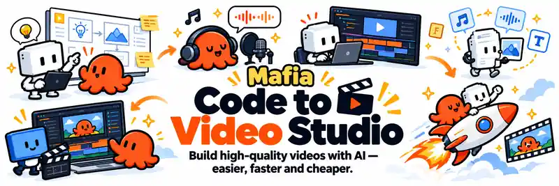

# Code to Video Studio — Mafia AI

<p align="center">
  
</p>

<p align="center">
  <a href="https://github.com/alexdcd/code-to-video-studio/actions/workflows/ci.yml"></a>
  <a href="LICENSE"></a>
  <a href="package.json"></a>
</p>

**Build high-quality videos with AI — easier, faster and cheaper.**

Build high-quality videos with Claude Code, Codex or your preferred coding agent.

Code to Video Studio gives your AI a reusable production base for **story, motion, characters, styles, visual QA and rendering**. Instead of starting from a blank folder, it starts with the rules and primitives that matter for **quality, consistency, iteration speed and context efficiency**.

That means fewer tokens wasted rediscovering the same timing rules, rewriting the same animation helpers or fixing the same render problems.

**Better output. Less repeated context. More consistency. Fewer dependencies.**

The project is moving toward a **local-first, modular production stack** where animation, SFX, voice and music workflows can live inside the studio and external APIs are optional, not required.

## See what it makes

**33 seconds. No footage. No stock. Just code.**

[](https://www.youtube.com/watch?v=v9jOQ9b87S0)

[▶ Watch on YouTube](https://www.youtube.com/watch?v=v9jOQ9b87S0) · [Open the MP4](https://raw.githubusercontent.com/alexdcd/code-to-video-studio/main/media/code-to-video-studio-teaser-web.mp4)

---

## Why this repo exists

AI agents can already write surprisingly good animation code. The harder problem is turning that ability into a **repeatable production advantage**.

A blank project makes the agent rediscover decisions you already paid for: structure, timing, motion rules, visual language, rendering constraints, review criteria and fixes from previous videos. That costs context, tokens and iterations — and still produces inconsistent one-offs.

Code to Video Studio stores those decisions in the repo instead of leaving them trapped in prompt history.

It gives the agent:

- a production workflow before it writes scenes
- deterministic, seek-safe animation rules
- reusable motion, style and character layers
- less repeated prompting and less duplicated implementation work
- visual review instead of “the code runs, so it must be done”
- measurable final-render checks
- a path toward local-first SFX, voice and music workflows without hard API lock-in
- a place to promote what worked so the next video starts with more capability than the last

**The repo is the production memory and creative grammar around the coding agent.**

Better models will keep arriving. The point of this project is to make each of them inherit a better studio instead of giving each one another blank canvas.

---

## What this is — and what it is not

This is **not** another video model, a prompt collection or a replacement for Premiere / After Effects.

It sits one layer above the rendering and animation tools:

```text
YOUR IDEA
   ↓
BRIEF + SCRIPT + STORYBOARD
   ↓
AI CODING AGENT
   ↓
CODE TO VIDEO STUDIO
   ├─ project contract
   ├─ reusable motion
   ├─ styles / characters
   ├─ deterministic animation
   ├─ visual snapshots
   ├─ render QA
   └─ reusable production rules
   ↓
HYPERFRAMES + GSAP + THREE.JS
   ↓
FINAL VIDEO
```

The useful abstraction is not “generate a video”.

It is **give an agent enough structure, reusable creative primitives and feedback loops to behave more like a production partner than a code generator.**

---

## Quick start

Requirements:

- Node.js 22+
- pnpm 11.28.0 (pinned via `packageManager`; available through Corepack or a pnpm installation)
- ffmpeg
- a coding agent is strongly recommended

```bash
git clone https://github.com/alexdcd/code-to-video-studio.git
cd code-to-video-studio

pnpm install
pnpm run setup

pnpm run new starter-9x16 my-video
pnpm run dev my-video
```

Then open the repository with Claude Code, Codex or your preferred coding agent and try:

> Read AGENTS.md and proyectos/my-video/BRIEF.md. Create a 15-second vertical video explaining how an AI agent turns a goal into actions. Keep one important visual idea on screen at a time. Use the starter style as a base, but create original scenes. Validate the project and inspect key snapshots before rendering.

When it is ready:

```bash
pnpm run check my-video
pnpm run render my-video
pnpm run contact-sheet proyectos/my-video/renders/my-video.mp4
pnpm run qa proyectos/my-video/renders/my-video.mp4
```

---

## The production loop

The studio follows a deliberately simple loop:

```text
BRIEF
  ↓
SCRIPT
  ↓
STORYBOARD
  ↓
SCENES + MOTION
  ↓
CHECK + SNAPSHOTS
  ↓
VISUAL REVIEW
  ↓
RENDER + QA
  ↓
PROMOTE WHAT WORKED
  ↺
```

That final step matters.

If a motion primitive, character behavior, scene pattern, style rule or production helper proves useful across projects, it should move into the reusable layer instead of being copied into the next video.

**The target is a studio that becomes more capable through use.**

---

## What you get today

### Agent-first workflow

`AGENTS.md` tells the coding agent how to work before it starts improvising: project boundaries, timing rules, determinism constraints and the visual review loop.

### Deterministic motion

Rendered video must survive seeking, snapshots and frame-by-frame rendering. The included `MAFIA` helpers provide seeded randomness and time-derived motion instead of fragile frame-to-frame state.

```js
const r = MAFIA.rand(42);

const pose = MAFIA.anim.jump(t, 1.0, 1.7, 120);
const wobble = MAFIA.anim.spring(t, 1.7);
const [x, y] = MAFIA.anim.shake(t, 6, 24, 9);
```

### Reusable motion language

The core includes a deliberately small set of primitives for common animation behavior:

```js
MAFIA.anim.spring(...)
MAFIA.anim.arc(...)
MAFIA.anim.jump(...)
MAFIA.anim.shake(...)
MAFIA.anim.pulse(...)
MAFIA.draw(...)
MAFIA.pop(...)
MAFIA.porCuadro(...)
```

### Visual QA

A video is not considered correct just because the code runs.

The workflow asks the agent to inspect key poses, transitions, snapshots and a contact sheet. The final render can also be checked for measurable problems such as long static sections, black frames, loudness, true peak and long silences.

### Three.js support

The public core includes deterministic Three.js motion helpers, motion blur and HTML/SVG annotations projected from 3D anchors for scenes that need more spatial depth.

### SFX workflow

The studio includes optional helpers for finding SFX candidates and cleaning audio assets before they enter a project.

### Your visual identity stays separate

The starter is intentionally neutral. Your own characters, typography, visual language, recurring scenes and brand assets can live on top of the reusable core without being coupled to it.

---

## What can you build?

The system is especially useful for videos that benefit from being generated, repeated, versioned or controlled by code:

- short-form explainers
- animated AI / technology content
- product explainers
- visual essays and data stories
- kinetic typography
- code-drawn diagrams
- music-led motion pieces
- branded recurring formats
- reusable animated characters
- deterministic Three.js scenes
- video formats that need many variations

It is less useful when your project is mainly traditional footage editing or needs the full flexibility of a nonlinear editor.

---

## Repository map

```text
kit/
  lib/                  reusable MAFIA helpers + deterministic motion
  styles/               reusable visual systems
  characters/           reusable code-driven characters

templates/
  _common/              project contract: brief, script, storyboard, agent notes
  starter-9x16/         neutral vertical starter

proyectos/
  demo/                 small working example

skills/
  README.md              canonical skill registry and install/package commands
  mafia-ai-character-creator/  reusable animated-character authoring skill

scripts/
  new.mjs               create a project
  in-project.mjs        run HyperFrames commands against a project
  kit-copy.mjs          copy the current kit into a project
  contact-sheet.mjs     visual review helper
  sfx-candidates.mjs    optional SFX discovery helper
  lib/qa-video.py       measurable final-render QA

docs/
  agent-workflow.md
  animation.md
  creating-styles.md
  creating-characters.md
  three.md
  qa.md
  sfx.md
```

---

## Agent skills

Portable Studio skills live in `skills/`. The registry and each skill's SHA-256 distribution manifest are the source of truth; Claude and Codex directories are install destinations.

```bash
pnpm run skills list
pnpm run skills install mafia-ai-character-creator --target claude
pnpm run skills install mafia-ai-character-creator --target codex
pnpm run skills validate mafia-ai-character-creator
pnpm run skills package mafia-ai-character-creator
```

See [`skills/README.md`](skills/README.md) for the registry and package workflow.

---

## Why HyperFrames + GSAP?

**HyperFrames** provides a video-oriented runtime: compositions, preview, snapshots, validation and rendering.

**GSAP** provides expressive timelines and mature animation primitives.

**Three.js** is available when a scene benefits from 3D.

Code to Video Studio adds the production layer around them:

- how the agent should approach the job
- how projects are structured
- which rules keep animation render-safe
- how reusable creative systems are organized
- how visual output is checked
- how successful work is promoted back into the studio

The project is intentionally not trying to hide the underlying tools. It is trying to make them work together coherently for AI-assisted production.

---

## The current plan

The direction of the project is deliberately narrower than “build an all-purpose video framework”.

### 1. Keep the public core small and dependable

The reusable engine, project contract, render-safe motion rules and QA should stay understandable enough that an agent can reason about them without loading a giant framework into context.

### 2. Build creator capabilities as modular, local-first layers

Characters, styles, diagrams, SFX, voice and music workflows should stay composable rather than turning the core into one opinionated stack. Where practical, they should be able to run locally or with creator-owned tools so paid external APIs remain optional integrations, not architectural dependencies.

### 3. Add specialized agent workflows as reusable skills

Some jobs deserve their own repeatable workflow: creating a character kit, preparing sound, auditing a render or building a specific kind of scene. Those workflows should be distributable independently while still fitting the studio contract.

### 4. Tighten the feedback loop

The long-term advantage is not more animation helpers. It is better iteration: stronger snapshots, visual checks, measurable QA and clearer agent feedback so mistakes are caught before the final render.

### 5. Promote only what survives real production

Mafia AI's private projects are used as a testing ground. Generic pieces that prove useful across real videos can be cleaned up and promoted into the public core; brand-specific assets and one-off creative work stay private.

### 6. Build a library of real examples

The repo should increasingly show complete outputs and reusable patterns, not just APIs. A production tool is easier to understand when people can see what it actually makes.

That means the roadmap will follow **real production bottlenecks**, not feature-count vanity.

---

## A few rules that matter

Programmatic video has different failure modes from ordinary web animation.

- Never use unseeded `Math.random()` for rendered state.
- Do not use `Date.now()` or `performance.now()` for rendered state.
- Do not accumulate animation physics frame by frame.
- Important motion should be derived from time so seeking remains correct.
- Keep IDs unique after compositions are assembled.
- Review key poses and transitions visually.
- Prefer one important reading at a time over five simultaneous effects.

The complete contract lives in [AGENTS.md](AGENTS.md).

---

## Build your own visual system

A reusable style can define:

- palette
- typography
- composition rules
- transitions
- camera language
- recurring visual motifs
- scene conventions

A reusable character can define:

- structure
- expressions
- poses
- entrances and exits
- deterministic actions
- animation helpers

The aim is to build a **video system that compounds**, instead of prompting a new aesthetic from scratch every time.

---

## Public core, private identity

This repository contains the open core and a neutral starter.

Mafia AI's production projects, brand assets and private creative libraries remain separate. That separation is intentional and useful for anyone adopting the studio: keep the reusable engine independent from the assets that make your work recognizably yours.

---

## Status

**Early public release.**

The core comes from a working private production system, but the public distribution is intentionally smaller and cleaner. Expect the APIs and starter layer to evolve as more real videos are produced and the reusable pieces become clearer.

Issues and focused pull requests are welcome.

---

## Made something with it?

Show the output.

Open an issue with what you built, what worked and what the studio made difficult. Real production examples are more valuable to the project than speculative feature lists.

If the project is useful to you, a GitHub star helps other creators discover it.

---

## Contributing

Reusable fixes, motion primitives, scene systems and genuinely general workflow improvements are welcome.

Please read [CONTRIBUTING.md](CONTRIBUTING.md) first. Keep the core generic: brand-specific assets and one-off project code belong in your own creator layer.

---

## License

Code in this repository is released under the [Apache License 2.0](LICENSE).

**Mafia AI**, **La Mafia IA**, their names, logos and brand identity are not granted under the software license. See [TRADEMARKS.md](TRADEMARKS.md).

Third-party dependencies keep their respective licenses.

---

## Built by Mafia AI

Code to Video Studio is maintained by **Mafia AI** as an ongoing experiment in using AI agents as creative production partners, not just code generators.
